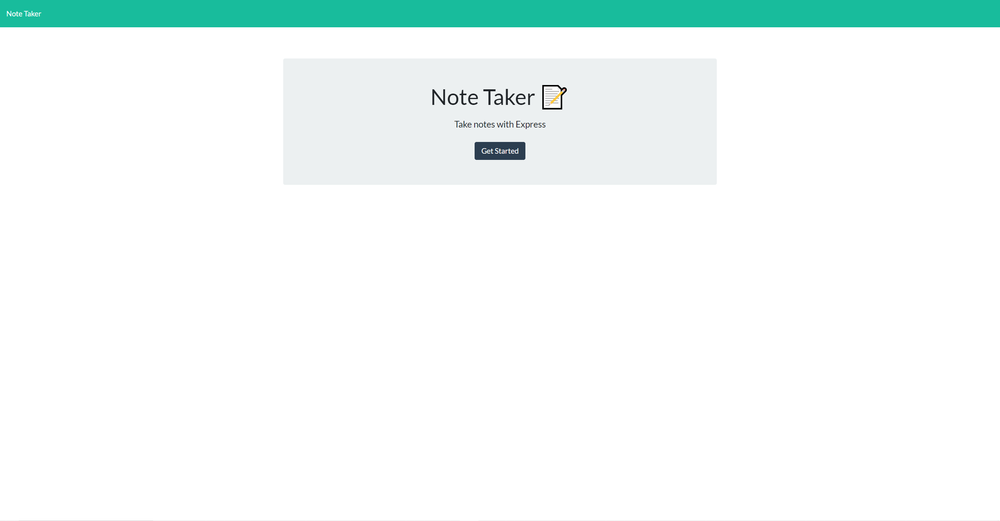

# Note Taker

  
#### Table of Contents
1. [Description](#description)
2. [Installation](#installation)
3. [Usage](#usage)
4. [Credits](#credits)
5. [License](#license)
6. [Questions](#questions)
## Description
* This application can be used for creating notes. It will store your note to a database to be retrieved later or deleted.
## Installation 
* You can use this application by visiting [Note Taker](https://blooming-mountain-01946.herokuapp.com/)
## Usage 
* This app should be used to boost your productivity by reminding you of tasks
## Credits
* Justin Welch

## License
    

This project is covered under the  [MIT](https://opensource.org/licenses/MIT) License
    

## Questions
* For additional help or if you would like to contribute to this project reach out to me at Justin.Welch075@gmail.com
* Follow me on Github at [JWelch775](http://github.com/JWelch775)